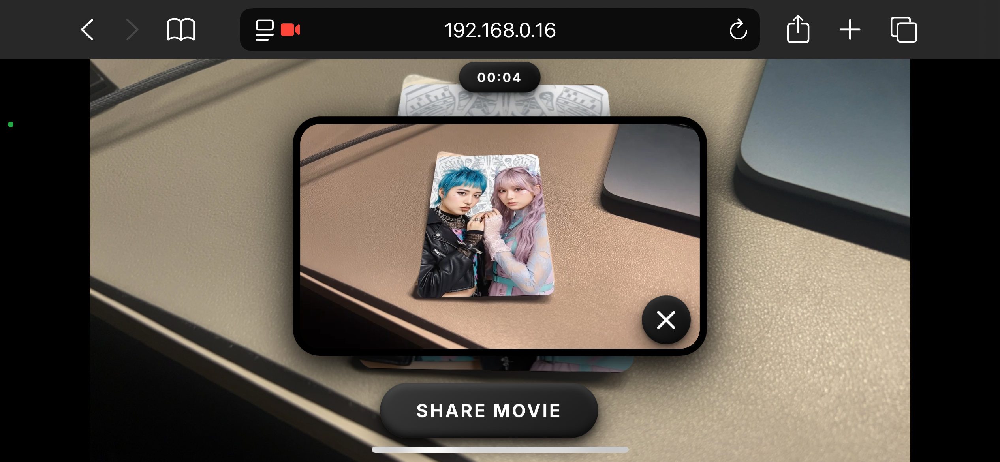

# Snap Camera Kit for Web UI

Snap Camera Kit for Webを使用したAR体験アプリケーションです。ブラウザ上でLens（ARエフェクト）を表示し、写真撮影・動画録画機能を提供します。

## 特徴

- 📸 **写真撮影機能** - AR体験中の静止画をキャプチャ
- 🎥 **動画録画機能** - AR体験を動画として録画
- 🎨 **Lens対応** - Snap Camera KitのLens（ARエフェクト）を表示
- 📱 **レスポンシブ対応** - スマートフォン・タブレット・PCに対応
- 🔄 **横向き（ランドスケープ）対応** - 画面の向きに応じてUIが自動調整
- 🔊 **効果音** - 撮影・録画時に効果音を再生
- 🎯 **マーカートラッキング対応** - マーカー検出に対応したLensに対応

## デモ

### 動画デモ（音声付き）

アプリケーションの動作デモ（効果音も含まれています）：

**📹 [YouTube Shortsでデモ動画を見る](https://youtube.com/shorts/O7tQmNVwUL8)**

[](https://youtube.com/shorts/O7tQmNVwUL8)

*画像をクリックするとYouTubeで動画を再生できます（音声付き）*

### スクリーンショット

横向き（ランドスケープ）表示の例：



## クイックスタート

1. **リポジトリをクローン**
   ```bash
   git clone https://github.com/ykassy/SnapCamerakitForWebUI.git
   cd SnapCamerakitForWebUI
   ```

2. **依存関係をインストール**
   ```bash
   npm install
   ```

3. **設定ファイルを編集**
   - `src/settings.js` を開いて、API TokenとLens IDを設定

4. **開発サーバーを起動**
   ```bash
   npm run serve
   ```

5. **ブラウザでアクセス**
   - `https://localhost:9001` にアクセス
   - 初回アクセス時、ブラウザでセキュリティ警告が表示される場合があります
   - 「詳細設定」→「localhost にアクセスする（安全ではない）」をクリック

## 技術スタック

- **Snap Camera Kit for Web** - AR体験の実装
- **Webpack** - ビルドツール
- **Vanilla JavaScript** - フレームワークなしのシンプルな実装
- **CSS3** - モダンなUIデザイン

## 前提条件

- **Node.js** v14以上
- **npm** または **yarn**
- **Snap Camera Kit API Token** - [Camera Kit管理画面](https://camera-kit.snapchat.com/)から取得
- **Lens ID** - Lens Studioで公開したLensのID

## セットアップ

### 1. 依存関係のインストール

```bash
npm install
```

### 2. 設定ファイルの編集

`src/settings.js` を開いて、以下を設定してください：

- `apiToken` - Snap Camera KitのAPI Token
- `lensID` - 使用するLensのID
- `groupID` - LensのGroup ID

### 3. 開発サーバーの起動

```bash
npm run serve
```

開発サーバーは `https://localhost:9001` で起動します。

### 4. ビルド（本番用）

```bash
npm run build
```

ビルドされたファイルは `docs/` ディレクトリに出力されます。

## プロジェクト構成

```
SnapCamerakitForWebUI/
├── docs/              # ビルド後の公開用ファイル
│   ├── assets/        # 画像・GIFファイル
│   ├── index.html     # メインHTMLファイル
│   └── *.css, *.js    # スタイルシート・JavaScript
├── src/               # ソースコード
│   ├── main.js        # メインエントリーポイント（Camera Kit初期化、撮影機能）
│   ├── settings.js   # 設定ファイル（API Token、Lens ID等）★要編集
│   └── remoteAPI.js   # Remote API実装（オプション）
├── webpack.config.js  # Webpack設定
└── package.json       # 依存関係
```

**重要なファイル：**

- `src/settings.js` - **必ず編集が必要** - API TokenとLens IDを設定
- `src/main.js` - Camera Kitの初期化、カメラ制御、撮影機能
- `src/remoteAPI.js` - Remote API機能（`useRemoteAPI: true` の場合のみ使用）

## 使用方法

1. **開発サーバーを起動**
   ```bash
   npm run serve
   ```

2. **ブラウザでアクセス**
   - `https://localhost:9001` にアクセス
   - 初回アクセス時、ブラウザでセキュリティ警告が表示される場合があります
   - 「詳細設定」→「localhost にアクセスする（安全ではない）」をクリック

3. **権限の許可**
   - カメラ・マイクの許可を求められたら「許可」をクリック

4. **AR体験を開始**
   - 「AR START !!」ボタンをクリック

5. **撮影・録画**
   - **写真撮影**: 撮影ボタンをタップ
   - **動画録画**: 撮影ボタンを長押し（0.3秒以上）
   - **カメラ切り替え**: 右上のカメラ切り替えボタンをクリック

6. **プレビュー・シェア**
   - 撮影後、プレビュー画面で確認
   - 「SHARE PHOTO」または「SHARE MOVIE」でシェア

**横向き（ランドスケープ）対応：**
- デバイスを横向きにすると、UIが自動的に調整されます
- 縦向き・横向きの両方で快適に使用できます

## カスタマイズ

### 必須設定

`src/settings.js` で以下を設定してください：

```javascript
apiToken: "YOUR_API_TOKEN_HERE",  // Camera Kit管理画面から取得
lensID:  "YOUR_LENS_ID_HERE",     // Lens Studioで公開したLensのID
groupID: "YOUR_GROUP_ID_HERE",    // LensのGroup ID
```

**取得方法：**
- **API Token**: [Camera Kit管理画面](https://camera-kit.snapchat.com/)から取得
- **Lens ID / Group ID**: Lens Studioで公開したLensの情報から取得

### Remote API（オプション）

マーカー検出時のリダイレクト機能を使用する場合：

```javascript
remoteAPISpecId: "YOUR_REMOTE_API_SPEC_ID_HERE",  // Snap管理画面から取得
redirectUrl: "https://example.com/",              // リダイレクト先URL
useRemoteAPI: true,                                // Remote APIを有効化
```

**Remote APIについて：**
- マーカー検出などのイベントをサーバー側で処理できます
- マーカー検出時に指定URLにリダイレクトする機能が実装済み
- 使用しない場合は `useRemoteAPI: false` のまま


## ブラウザ対応

- ✅ Chrome (最新版)
- ✅ Safari (最新版)
- ✅ Firefox (最新版)
- ✅ Edge (最新版)
- ✅ モバイルブラウザ (iOS Safari, Chrome for Android)

## ライセンス

ISC

## 注意事項

⚠️ **必須設定**
- `src/settings.js` の `apiToken`、`lensID`、`groupID` は**必ず実際の値に置き換えてください**
- デフォルト値はダミー値のため、そのままでは動作しません

🔒 **セキュリティ**
- カメラ・マイクの許可が必要です
- HTTPS環境またはlocalhostでのみ動作します

📝 **その他**
- Remote APIを使用する場合は、`useRemoteAPI: true` に設定し、`remoteAPISpecId` を設定してください

## トラブルシューティング

### カメラが起動しない
- ブラウザでカメラの許可を確認してください
- HTTPS環境またはlocalhostで実行しているか確認してください

### Lensが表示されない
- `src/settings.js` のAPI TokenとLens IDが正しく設定されているか確認してください
- ブラウザのコンソールでエラーメッセージを確認してください

### ビルドエラー
- Node.jsのバージョンがv14以上であることを確認してください
- `npm install` を再実行してください

## 変更ログ

### 2025-12-04
- カメラチェンジボタンが効かないバグを修正
  - `.camera-switcher-btn-wrapper.active`に`pointer-events: auto`を追加
  - カメラ切り替え処理のエラーハンドリングを改善
  - 開発サーバーのポートを9002に変更

## 貢献

プルリクエストやイシューの報告を歓迎します。

## 作成者

このプロジェクトは [HACK IT INC.](https://hackitinc.jp/) によって開発されました。

**HACK IT INC.** は、ARコンテンツ・アートディレクションの企画・制作を行うプロデュースチームです。

- 🌐 [公式サイト](https://hackitinc.jp/)
- 📧 ARを通じて企業の本質や世界観を「体験」として繋げるプロデュースを提供
- 🎨 WebAR、TikTok AR、地理情報AR、メディアアートなど、最新技術とビジュアルデザインを組み合わせたAR体験を制作

